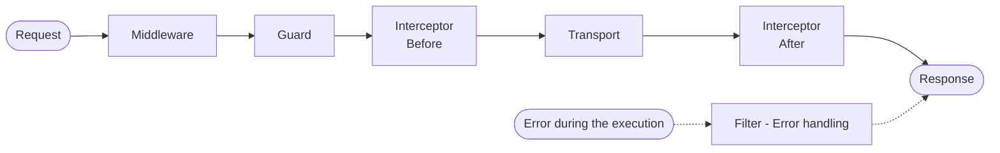

# Engine Steps

In the Engine System, the engine steps are the core components that define the workflow and behavior of any execution (request). Each step represents a specific action or operation that needs to be performed during the execution process. The engine steps are responsible for processing the input data, executing the necessary logic, and producing the output data.

The main step in a workflow is the transport step, which runs the main logic of the execution. In addition to the transport step, there are other steps that can be used to enhance the execution process, such as pre-processing steps, post-processing steps, and error handling steps. These steps can be added to the workflow to customize the behavior of the engine and to handle specific scenarios.



## Implemented Steps

AxiSpark.js provides 5 types of engine steps that can be used to build complex workflows and to handle various execution scenarios. These steps are:

<table>
    <thead>
        <tr>
            <th>Class Decorator</th>
            <th>Method Decorator</th>
            <th>Order</th>
            <th>Description</th>
        </tr>
    </thead>
    <tbody>
        <tr>
            <td><code>@Middleware()</code></td>
            <td><code>@Handle()</code></td>
            <td>First of all steps</td>
            <td>
                The Middleware step is the first step that is executed in the workflow. It is responsible for processing the input data and for performing any necessary pre-processing operations.
            </td>
        </tr>
        <tr>
            <td><code>@Guard()</code></td>
            <td><code>@Check()</code></td>
            <td>Next to Middleware</td>
            <td>
                The Guard step is executed after the Middleware step. It is responsible for performing any necessary validation checks and for ensuring that the input data meets the required criteria.
            </td>
        </tr>
        <tr>
            <td><code>@Interceptor()</code></td>
            <td><code>@Before()</code></td>
            <td>Next to Guard</td>
            <td>
                The Interceptor step is executed after the Guard step. It is responsible for intercepting the execution flow and for performing any necessary operations before the main transport step is executed. It is the last step before the transport step.
            </td>
        </tr>
        <tr>
            <td><code>@Interceptor()</code></td>
            <td><code>@After()</code></td>
            <td>After the transport step</td>
            <td>
                The Interceptor step is executed after the transport step. It is responsible for intercepting the execution flow and for performing any necessary operations after the main transport step has been executed. It is the first step after the transport step.
            </td>
        </tr>
        <tr>
            <td><code>@Filter()</code></td>
            <td><code>@Catch()</code></td>
            <td>At any time</td>
            <td>
                It is executed at any time during the execution process. It is responsible for handling any errors or exceptions that may occur during the execution process and for providing a mechanism for error handling and recovery.
            </td>
        </tr>
    </tbody>
</table>

## Class Decorators

Each class decorator accepts some parameters that can be used to customize the behavior of the step. Here are the parameters and their descriptions:

```ts title="step-target-metadata.ts"
export interface StepTargetMetadata extends MetadataFromClass {
    /**
     * Define if the step is global or not. A global step will be executed for all methods, while a non-global step will only be executed for methods that have registered the step using @Use().
     * Default is true
     */
    global: boolean;
    /**
     * Define the priority of the step. Steps with higher priority will be executed first.
     * Default is 0
     */
    priority: number;
    /**
     * Define the transport of the step. Use All to indicate that the step is executed for all transports.
     * Default is All
     */
    transport: ExecutionTransport;
    ...
}
```

## Use Decorator

If you want to use an engine step for a specific method, or class, and you don't want to use it globally, you can use the `@Use()` decorator. This decorator allows you to register a specific engine step for a method or class, without affecting the global behavior of the step.

```ts title="use-decorator.ts"
@Use(MyMiddleware)
export class MyController {
    @Use(MyGuard)
    @Get('example')
    public myMethod() {...}
}
```